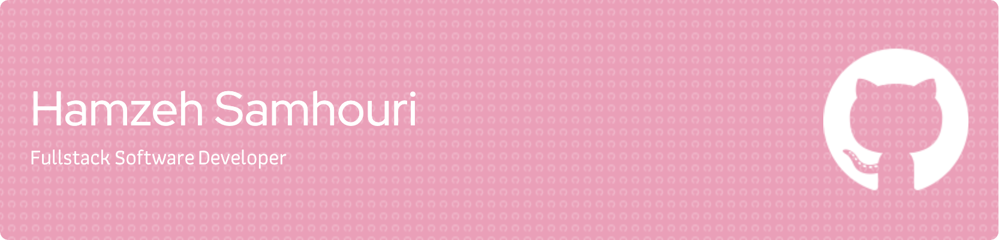

**Technical Languages:** [​Python, JavaScript, Java, SQL, HTML5, CSS​]

**Frameworks/Libraries:** [Django, Flask, NodeJS, ReactJS, ExpressJS, MongooseJS, Spring Boot, AngularJS, jQuery, Bootstrap] Databases [MySQL, MongoDB] 

**Tools:** [AJAX, JSON, RESTful API,  JSP, DOM, AWS, AWS EC2, Postman, npm, Axios, MySQL Workbench, Jinja2, API, GitBash, GitHub, Balsamiq]

**Other:** [MATLAB, SOLIDWORKS, LABVIEW, Embedded Systems Design - Arduino Uno microcontroller board wiring and integration into LABVIEW]

### [Connect with me on LinkedIn](http://www.linkedin.com/in/hamzehsamhouri)
